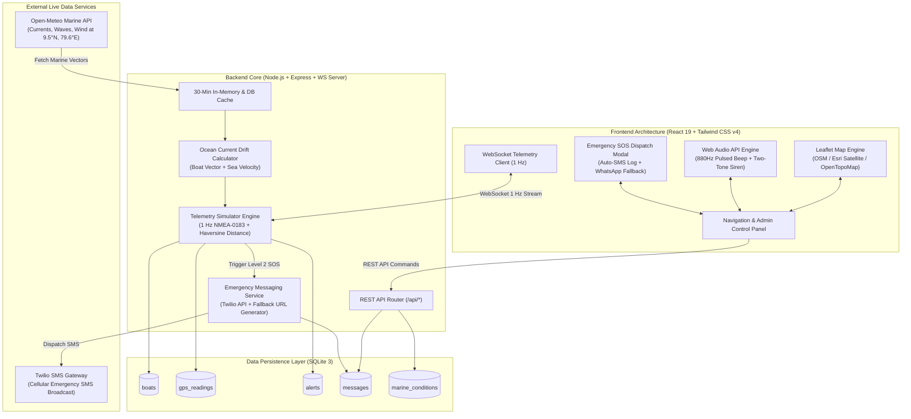
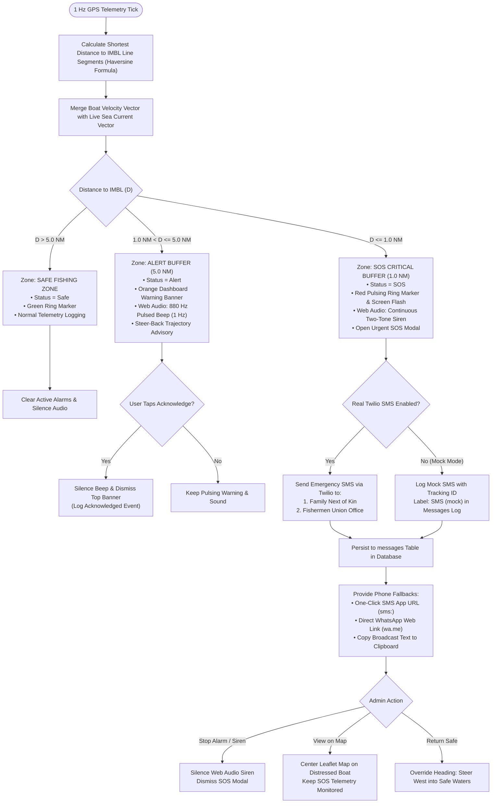

# 🛡️ MaritimeGuard (மாறிட்டிமாகார்ட்)
**Intelligent Maritime Border Safety, Life-Saving Geo-Fence & Telemetry Platform for Tamil Nadu Fishermen**

[](#)
[](#)
[](#)
[](#)
[](#)

> **⚠️ Disclaimer**: *Hackathon Prototype. Running in demo mode with simulated GPS telemetry. Not certified for actual at-sea navigation.*

---

## 🌊 1. Executive Summary & Problem Context

In the narrow, highly contested marine corridor of the **Palk Strait** and the **Gulf of Mannar** separating Tamil Nadu (India) and Sri Lanka, thousands of traditional artisanal fishermen operate out of historical fishing hubs like **Rameswaram, Pamban, Mandapam, and Thangachimadam**.

Due to strong, shifting sea currents, fog, lack of navigational instrumentation, and engine drift, fishing trawlers frequently drift across the invisible **International Maritime Boundary Line (IMBL)** into Sri Lankan territorial waters, leading to vessel seizures, arrests, and loss of life.

**MaritimeGuard** bridges this safety gap with:
1. **Real-time border geo-fencing** with dual buffer zones (5.0 NM Warning & 1.0 NM SOS).
2. **Dynamic ocean current drift calculation** incorporating live marine telemetry.
3. **Automated multi-channel SOS emergency broadcasts** (Twilio SMS & one-click WhatsApp) dispatched to fishermen's families and union offices the instant a breach occurs.
4. **Autonomous acoustic deterrence** via synthesised web audio sirens and directional steer-back guidance.

---

## 🏗️ 2. System Architecture



---

## 🔄 3. Alert & Emergency Decision Flowchart



---

## ⚓ 4. Key Functional Modules

### 🗺️ 1. Interactive Cartographic Map
- **Interactive Multi-Layer Engine**: Leaflet with custom tiles:
  - **OpenStreetMap Standard**: Clear natural navigation base.
  - **Esri World Imagery**: Satellite oceanography layer.
  - **OpenTopoMap**: Relief and bathymetric contours.
- **IMBL Border Line**: Thick red international zero-tolerance boundary segment coordinates between India and Sri Lanka.
- **Alert Buffer Line**: Orange dashed parallel line at **5.0 Nautical Miles (NM)**.
- **SOS Buffer Line**: Red dashed parallel line at **1.0 Nautical Mile (NM)**.
- **Safe Fishing Zone**: Polygonal green shaded territorial water safety zone on the Indian shelf.
- **Rotated Ship Icons**: Live vessel markers rotated according to heading degree, surrounded by glowing status rings (Green Safe, Orange Alert, Pulsing Red SOS) with fading 40-position breadcrumb trails.

### 🛰️ 2. Realistic 1 Hz GPS Simulator
- Runs an asynchronous telemetry loop generating NMEA-compatible positional updates every second.
- Realistic artisanal speeds (3–7 knots), gentle heading perturbations, and **5–10 meter Gaussian sensor jitter**.
- Shortest perpendicular distance calculated using the **Haversine formula** across all IMBL polyline segments.
- Speed simulation multipliers: **1x**, **5x**, and **10x**, with instant pause and resume.

### 🌊 3. Live Marine Conditions & Drift Vector
- Queries the free **Open-Meteo Marine API** for:
  - Ocean current velocity ($\text{km/h}$ / $\text{m/s}$ converted to **knots**).
  - Ocean current flow direction ($0^\circ - 360^\circ$).
  - Significant wave height (meters).
  - Wave propagation direction ($^\circ$).
- 30-minute caching in SQLite with fallback to cached database telemetry or safe defaults ($0.5\text{ kn}$ toward border).
- Combined boat + ocean current vector model:
  $$\vec{v}_{\text{total}} = \vec{v}_{\text{engine}} + \vec{v}_{\text{current}}$$

### 🔮 4. Predictive Trajectory Warnings
- Calculates estimated time to breach the 5.0 NM alert buffer:
  $$T_{\text{cross}} = \frac{D_{\text{to buffer}}}{\vec{v}_{\text{projected}} \cdot \hat{n}_{\text{border}}}$$
- Triggers dynamic card pill: `Predicted to cross alert line in X minutes` when under 45 minutes, or `Moving safely away from border`.

### 🔊 5. Two-Level Web Audio Deterrence
- **Level 1 Alert (5.0 NM)**: Repeating 880 Hz square-wave beep emitted once per second. Stops immediately upon clicking **Acknowledge** or steering back to safety.
- **Level 2 Critical SOS (1.0 NM)**: Loud continuous alternating two-tone siren (600 Hz / 900 Hz).
- User interaction unlock gate adhering to modern browser autoplay policies with test sound diagnostic buttons.

### 📱 6. Emergency Messaging Gateway & Twilio Integration
- Automated background emergency dispatch to **Family Next of Kin** and the **Fishermen Union Office**:
  ```text
  EMERGENCY SOS. Boat Annai Mary (IND-TN-10-MM-1024) is 0.85 NM from the maritime border.
  Position: 9.3821 N, 79.4041 E. Speed 5.2 kn, heading 57 deg.
  Map: https://maps.google.com/?q=9.3821,79.4041
  Contact captain and union immediately.
  ```
- **Real SMS Mode**: Dispatches over cellular network via Twilio Messages API.
- **Mock SMS Mode**: Runs offline without API keys, logging all dispatch metadata to SQLite.
- **One-Click Fallbacks**: Native `sms:` link buttons, pre-filled WhatsApp links (`wa.me`), and clipboard broadcast copy.

---

## 🗄️ 5. Database Schema (SQLite)

| Table | Purpose | Key Columns |
| :--- | :--- | :--- |
| `boats` | Registered vessel fleet | `id`, `name`, `reg_number`, `captain_name`, `crew_count`, `family_contact_phone`, `union_contact_phone`, `lat`, `lng`, `speed`, `heading`, `distance_to_imbl`, `status` |
| `gps_readings`| 1 Hz historical telemetry | `id`, `boat_id`, `lat`, `lng`, `speed`, `heading`, `distance_to_imbl`, `timestamp` |
| `alerts` | Audit log of boundary events | `id`, `boat_id`, `level` (Alert/SOS), `distance_to_imbl`, `acknowledged`, `timestamp` |
| `messages` | Outgoing emergency communications | `id`, `boat_id`, `recipient_type`, `phone`, `text`, `channel`, `status`, `provider_message_id`, `timestamp` |
| `marine_conditions` | Open-Meteo cache | `id`, `current_speed`, `current_direction`, `wave_height`, `wave_direction`, `fetched_time`, `source` |

---

## ⚡ 6. REST API Reference

### Fleet & Telemetry
- `GET /api/boats` — List all registered vessels with current GPS coordinates and statuses.
- `GET /api/boats/:id` — Get single vessel profile, telemetry, and contact info.
- `PUT /api/boats/:id/contacts` — Validate and update family & union phone numbers (`+91...`).
- `GET /api/status` — Get overall system status (simulation speed, marine condition, SMS mode).

### Demo Simulation Controls
- `POST /api/demo/start` — Deploy vessels in safe fishing zone.
- `POST /api/demo/reset` — Reset all boats, clear alerts, and restore seed state.
- `POST /api/demo/pause` — Pause or resume telemetry clock (`{ "paused": true/false }`).
- `POST /api/demo/speed` — Set telemetry time speed multiplier (`1`, `5`, `10`).
- `POST /api/demo/drift/:id` — Steer selected vessel into the border buffer sequence.
- `POST /api/demo/instant-sos/:id` — Teleport vessel directly to 0.9 NM SOS breach.
- `POST /api/demo/return-safety/:id` — Steer vessel westwards back to Indian territory.

### Alerts & Messaging
- `GET /api/alerts` — Fetch historical boundary alerts timeline.
- `POST /api/alerts/:id/acknowledge` — Acknowledge and silence alert in audit log.
- `GET /api/messages` — Fetch outgoing emergency SMS dispatch log.
- `POST /api/admin/toggle-real-sms` — Switch between Real Twilio SMS and Mock Mode.
- `POST /api/admin/send-test-sms` — Dispatch single test SMS to verify cellular credentials.

---

## 💻 7. Installation & Quickstart

### Prerequisites
- **Node.js** >= 18.x
- **npm** >= 9.x
- **Git**

### 1. Clone the Repository
```bash
git clone https://github.com/Joshan2007/MaritimaGuard.git
cd MaritimaGuard
```

### 2. Install Dependencies
```bash
# Install server dependencies
npm install

# Install client dependencies
cd client
npm install
cd ..
```

### 3. Configure Environment Variables
Create a `.env` file in the project root (optional for Twilio; defaults to Mock Mode if omitted):
```env
PORT=5000

# Optional Twilio credentials for real SMS dispatch
TWILIO_ACCOUNT_SID=your_twilio_account_sid
TWILIO_AUTH_TOKEN=your_twilio_auth_token
TWILIO_FROM_NUMBER=+1234567890
```

### 4. Run Backend Server
```bash
node server/index.js
# Express REST API & WebSocket server running on http://localhost:5000
```

### 5. Run Frontend Development Server
In a separate terminal:
```bash
cd client
npm run dev
# Vite server available at http://localhost:5173 (or http://localhost:5175)
```

### 6. Build for Production
```bash
cd client
npm run build
# Compiles production assets into client/dist/
```

---

## 🛠️ 8. Technology Stack

| Layer | Technology |
| :--- | :--- |
| **Frontend Framework** | React 19, Vite 8, Tailwind CSS v4 |
| **Mapping Engine** | Leaflet, React-Leaflet, OpenStreetMap, Esri Imagery, OpenTopoMap |
| **Sound Synthesis** | Web Audio API (OscillatorNode, GainNode) |
| **Icons & UI** | Lucide React |
| **Backend Framework** | Node.js, Express.js |
| **Real-Time Feed** | WebSockets (`ws`) |
| **Database** | SQLite 3 via `better-sqlite3` |
| **Marine Meteorology**| Open-Meteo Marine API |
| **Cellular Gateway** | Twilio REST Client API |

---

## 📜 9. License & Attribution
- Open-sourced under the **ISC License**.
- Developed as a humanitarian hackathon safety prototype for fishermen operating in Tamil Nadu coastal communities.
